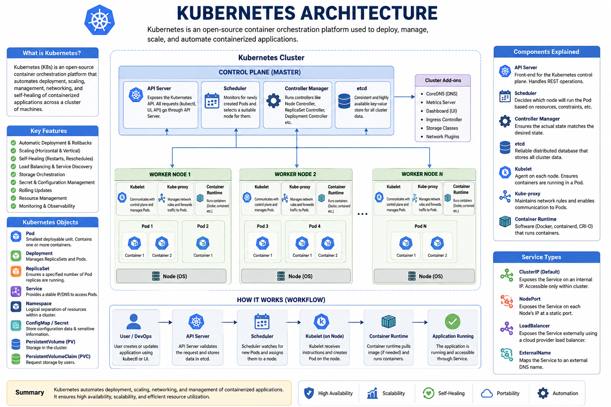

# Kubernetes
- Kubernetes (also knows as k8s) is an open-source container orchestration tool platform used to deploy , manage, scale, and automate containerized application
- it is written in Go-Language as it is developed by Google
now it is being maintained by Cloud Native Computing Foundation.

# Why Do We Need Kubernetes ?
- Running a few containers manually with Docker is easy. However, in a production environment, you may have hundreds of containers running across multiple servers.

- Managing them manually becomes difficult because you need to:

    - Restart failed containers automatically.
    - Scale the application during high traffic.
    - Distribute traffic among multiple container instances.
    - Perform rolling updates without downtime.
    - Manage networking and storage.
    - Kubernetes automates all of these tasks.

# Kubernetes Architecture
                           Kubernetes Cluster
                        --------------------------
                               Control Panel
                        --------------------------
                        API Server 
                        Scheduler
                        Controller Manager
                        etcd (Cluster Database)
                        -------------------------
                                Worker Nodes
                        -------------------------
                        node 1             node 2
                        ------             ------
                        pod(App)           pod (App)
                        pod(DB)            pod(DB)

# Amin Compoenents
1. Cluster
A Kubernetes Cluster consist of:
    - one Control Panel
    - One or more Worker Nodes

2. Node
- A Node is a machine(Physical or Virtual) where Containers run
- each Node includes
    - kubelete
    - Container runtime(Docker , containerd, etc.)
    - kube proxy

3. Pod
- a pod is the smallest deployable unit in kubernertes
- a pod contains :
    - One or more Containers
    - shared Networking
    - shared storage

4. Deployemnt
- A deployment manages pods.
- it can create,update,replace failing pods, rolling update, rollback

5. Service
- pods can have changind ip addresss.
- A service provides stable ip addresses or DNS name accros pods
- types: ClusterIP NodePort LoadBalancer ExternalName

6. ReplicaSet
- A replicaset ensures a specified Number of pods replicas are always running
- if one of the pod crashes it will create or restart the new pod automatically

7. Namespace
- Namespace logically separatess resources within cluster
- Example deafult kube-system dev prod

